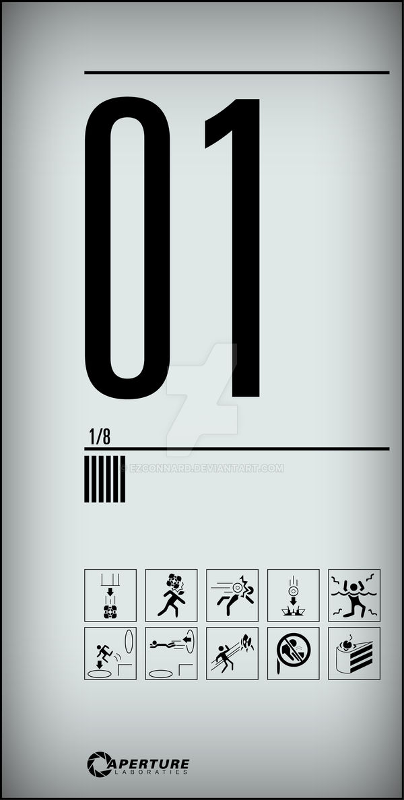

# seed
Repository with random riddles for DBSP's amusement

# Ideas

It should contain more interactive and different type of riddles (compared to seed pirates ones).
Sequential 

# Reward

Steam gift: "Reversion" (3 chapters?), a graphical adventure that happens inside FIUBA 

# UI

Full screen, using a layout similar to what Mel designed for my new website (primary colors).

On top, it should show a Portal style sign with "1/N" and related dangers/rewards:

## Entry point

The entry point shall be `seed.gzalo.com`

Will show an animated gif with multiple 4-letter names changing from one into another
For example, using codified "aqui, pone, tuuu, nomb, reen, codi, gonz". + ".gzalo.com"
(2/3 fps so that it can't be copied easily)

And below it should have a message saying: `Para comenzar el juego, codifica las primeras 4 letras de tu nombre`, with a picture of a Caesar Salad and a "+1" symbol.

# Riddles

## Starting: rotate key (reference to lost)

`Are you ready to begin the game? If you are unsure, you probably already LOST` (with LOST logo)
Drag and drop key
Disclaimer: This game is WIP, and it not have an end

## 1 - Anagram of your name
`To get started, insert a logical anagram of your name`
`Carolina <=> Racional`

## 2 - `What can you see` images

"per fec tos" ?
"Des + Conos + & + 2"

"Perfectos desconocidos"

## 3 - Reference to Lost

Desmond = Penny
Faraday = Desmond
WORD = Constant/Constante

## 4 - Audio reversing / pitch shifting

Link to an audio MP3 that says (reversed and pitch shifted):
`Yo soy goma, tu eres`
WORD = Cola/Glue

## 5 - Image filling

Whole white PNG image that says "this contains something"
- A strawberry
- A field 
- Forever (infinity)

Launch year of this image: 1967

## 6 - Translation of japanese characters (as audio)

イマージョン - Inmersión

## 7 - Rescramble QR code 
Broken puzzle QR code, it also returns a broken URL 

Something like `dbsp|http://|.gzalo|.com|/nextepisode`

## 8 - Pokemon pixel art

A couple of pokemons represented as minimalist pixel art.
Two of them selected with arrows, first and last part of name 

## 9 - Search the song

osfosf
psfpsf
pdgpdg
adgadg
(virtualPiano)

notas tiburón valdez hasta abajo papi
"Animal que emite esos sonidos" -> tiburón

"Hasta dónde?"

## 10 - Aristocats reference

Quién canta "do mi sol do do sol mi do" (en partitura)
=> Duquesa

## 11 - Impossible music

The
Light
(Kero Kero Bonito Remix)
Metronomy

`Walking in the ... It's scary in the ...`

## 12 - Chemistry Puzzles

Soy de acero, si me quemo aumento de peso

=> LANA

## Other ideas

### Dar vuelta
### Similar al memorioso/director de cine
### Químico, referencia al diccionario hash
### Facebook profile ID
### Numeric
### Search in a paper
`Improved Alpha-Tested Magnification for Vector Textures and Special Effects`
Figure 2, "high resolution"
### Search in a movie
Back to the future, minute and second (netflix logo)
something that appears in the back
### Search in an image
Random spectrogram with a 3d word
### Missing word of a list
### Coordinates
Couple of options that tell you different places, one of them is a place
### Where am I 
Image of a place, distance to another one
### Lost console to input words
### T9 / numeric encoding/decoding
### Morse code many combinations
